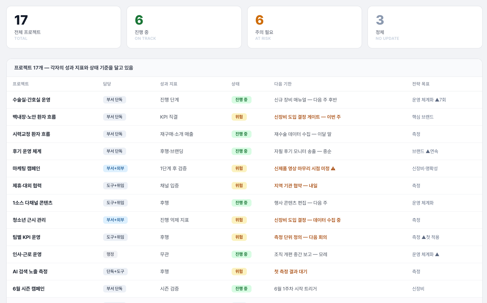

회의마다 새 아이디어가 태어나는 조직은 활기차 보입니다. 그런데 세어 보니 동시에 굴러가는 공이 열일곱 개였고, 그중 몇 개는 던진 사람조차 잊고 있었습니다. 그래서 살아 있는 프로젝트 현황판을 만들었습니다.

## 잊힌 공들

한 조직의 회의록을 몇 주 분석하면서 한 가지 패턴이 보였습니다. 매주 회의에서 새 일이 결정됩니다. 결정되는 순간의 에너지는 진짜입니다. 그런데 3주쯤 지나면 그중 일부가 회의에서 사라집니다. 중단 결정이 난 게 아닙니다. 그냥 아무도 다시 언급하지 않습니다.

이 조직만의 문제가 아닙니다. 리더의 아이디어가 풍부하고 회의가 잦은 조직일수록 이 패턴이 강합니다. **새 결정이 생기는 속도가 옛 결정이 마감되는 속도보다 빠르면, 잊힘은 구조적으로 생깁니다.**

가장 먼저 한 일은 단순했습니다. 세었습니다. 회의록을 거슬러 올라가며 "이 조직이 지금 진행하고 있는 일"을 전부 현황판으로 만들었습니다. 혼자 수십 회분 회의록을 다시 훑는 건 무리라, AI에게 회의록을 통째로 읽히고 "지금 진행 중으로 보이는 일"을 먼저 뽑게 했습니다. AI가 추려 온 후보를 놓고, 이게 정말 별개의 일인지 같은 일의 다른 표현인지는 제가 하나씩 판정했습니다. 그렇게 추리니 열일곱 개가 나왔습니다.

## 현황판에 무엇을 적는가

현황판은 이름 목록이 아닙니다. 항목마다 여섯 가지를 같이 적습니다.

| 칸 | 내용 | 왜 필요한가 |
|---|---|---|
| 프로젝트 | 이 일의 한 줄 정의 | 회의 때마다 표현이 바뀌어도 같은 일로 묶기 위해 |
| 담당 | 누가 주인인가 (조직 단독 / 도구 지원 / 외부 협업) | 내가 들어갈 일과 지켜볼 일의 구분 |
| 성과 지표 | 무엇으로 진척을 재는가 (진행률 / 빈도 / 단계 / 결정 지연 일수) | 일마다 재는 단위가 다르다. 전부 %로 재면 거짓말이 된다 |
| 상태 | 진행 중 / 위험 / 정체 / 보류 중 | 건강 상태를 한눈에 |
| 다음 기한 | 성과 지표마다 "얼마나 조용하면 경보인가" | 진행률형은 3주 무진행, 빈도형은 주간 0회 |
| 전략 목표 | 경영진의 어떤 큰 방향 아래 있는가 | 우선순위 판단 재료 |

성과 지표 칸이 핵심입니다. 일마다 재는 방식이 다르다는 걸 인정하는 순간, 정체 경보도 일마다 다르게 설계됩니다. 매주 돌아야 하는 일은 한 주만 멈춰도 경보가 뜨고, 분기 단위 일은 석 달 조용해도 정상입니다. 이 차이를 무시하고 한 가지 잣대로 추적하면, 경보가 너무 자주 울려서 결국 아무도 안 듣게 됩니다.

*매주 회의록 분석 직후 갱신하는 실제 현황판. 원장명·제품명·협력기관 등 식별 정보는 가렸습니다.*

## 현황판이 살아 있으려면

현황판은 만든 날 가장 정확하고 그다음 날부터 썩기 시작합니다. 그래서 운영 룰을 정했습니다.

- **매 회의 분석 직후 갱신.** 회의에서 언급된 항목은 진척을, 언급 안 된 항목은 정체 횟수를 기록합니다.
- **신설은 쉽게, 등재는 어렵게.** 새 일이 결정되면 현황판에 올리되, "이게 기존 항목의 일부인가, 진짜 새 프로젝트인가"를 먼저 점검합니다. 검토 단계의 일은 기존 항목 아래 두고, 도입이 확정될 때만 독립 항목으로 올립니다. 안 그러면 현황판도 새 아이디어가 늘어나는 속도만큼 부풀어 버립니다.
- **신설했다고 다 추적하지 않는다.** 최근에 추가한 룰입니다. 새 항목이라도 조직이 단독으로 굴리는 일이면 "지켜보며 축적"으로만 두고, 직접 추적은 하지 않습니다. 현황판의 모든 항목을 같은 강도로 들여다보면 정작 중요한 항목의 추적이 얕아집니다.
- **우선순위표를 같이 갱신.** 전략 목표 무게 + 담당 + 성과 입증 가능성을 합쳐 순위를 매깁니다. 순위는 자원 배분 논의의 출발점이 됩니다.

## 지금 작동 모습

지금 이 현황판에는 열일곱 개 항목이 각자의 성과 지표와 경보 조건을 달고 있습니다. 갱신은 AI와 사람이 나눠 합니다. 새 회의록이 들어오면 AI가 현황판 전체와 이번 회의록을 대조해, 이번에 언급된 항목·정체된 항목·새로 등장한 듯한 일을 1차로 나눕니다. 저는 그 새 일이 정말 새 프로젝트인지 기존 항목의 다른 표현인지만 판정합니다. 그러면 회의에서 사라진 일은 경보가 짚어 주고, "이거 어떻게 됐지?"라는 질문이 사람의 기억이 아니라 현황판에서 나옵니다. 거부된 제안도 지우지 않고 사유와 함께 남깁니다 — 같은 제안이 다시 올라올 때 그 기록이 가장 빠른 답이 됩니다.

## 현황판 갱신에 AI를 이렇게 적용했습니다

현황판을 매주 손으로 갱신하면 결국 안 하게 됩니다. 대조라는 반복 노동을 AI에게 넘깁니다.

| 단계 | 하는 일 |
|---|---|
| 준비 | 항목마다 프로젝트·담당·성과 지표·상태·다음 기한·전략 목표를 적는 현황판 양식을 정해 둡니다 |
| 입력 | 지금까지의 현황판 전체와 이번 회의록을 AI에게 함께 줍니다 |
| 요청 | "언급된 항목 / 정체된 항목 / 새로 등장한 듯한 일로 나눠 대조해 주세요" |
| AI가 하는 일 | 세 갈래 대조 정리 + 새 프로젝트 후보 표시 |
| 사람이 하는 일 | 새 일이 진짜 새 프로젝트인지 기존 항목의 다른 표현인지만 판정 |

대조라는 반복 노동은 AI가 맡고, 새 프로젝트인지 아닌지 최종 판단은 사람이 쥡니다.

## 저는 이렇게 시작했습니다

조직의 일이 자꾸 잊힌다고 느낀다면, 추적 도구를 도입하기 전에 일단 세어 보면 좋습니다. 저도 거창한 시스템으로 시작하지 않았습니다. 회의록을 AI에게 주고 "지금 동시에 진행되는 일을 목록으로 뽑아 줘"라고만 했습니다. 동시에 굴리는 공이 몇 개인지 정확히 아는 것만으로, 대화의 절반이 달라졌습니다.
